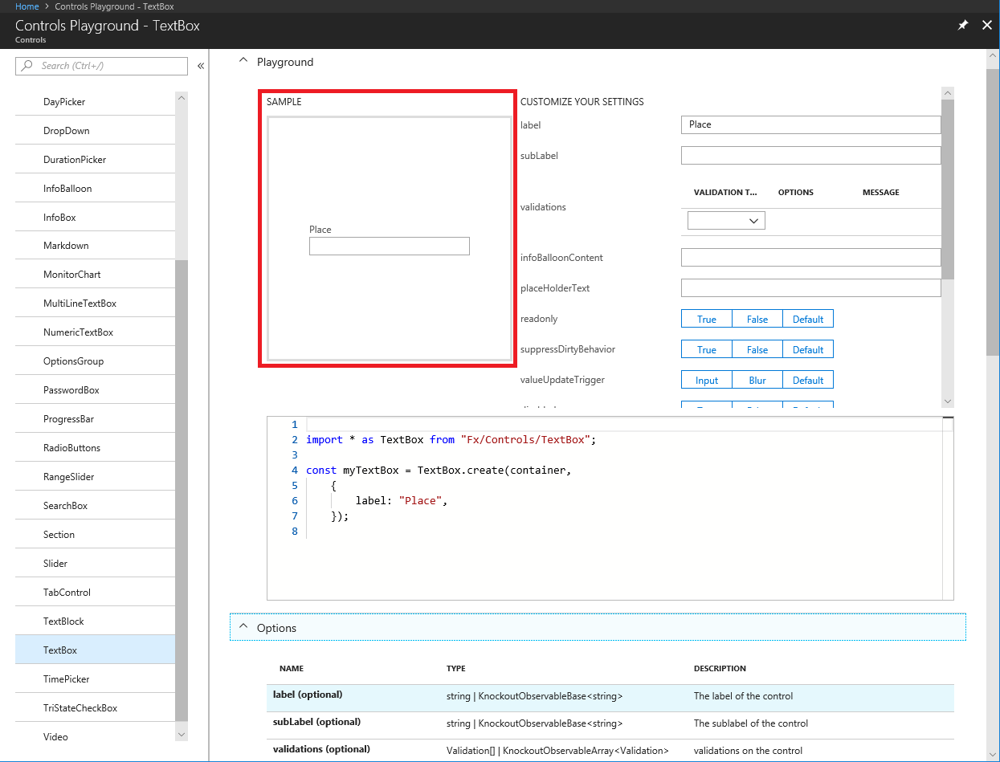
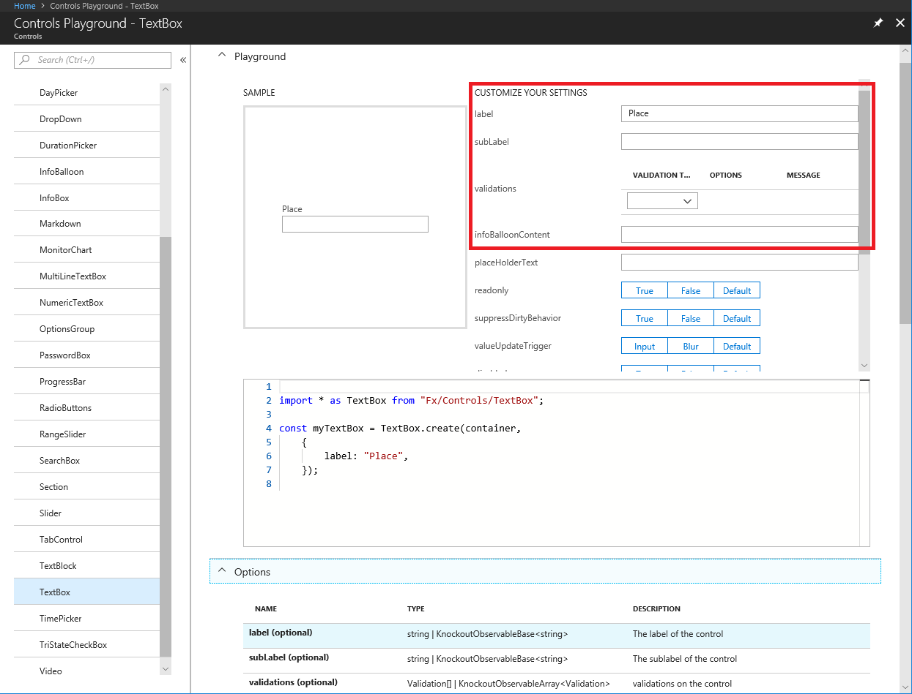
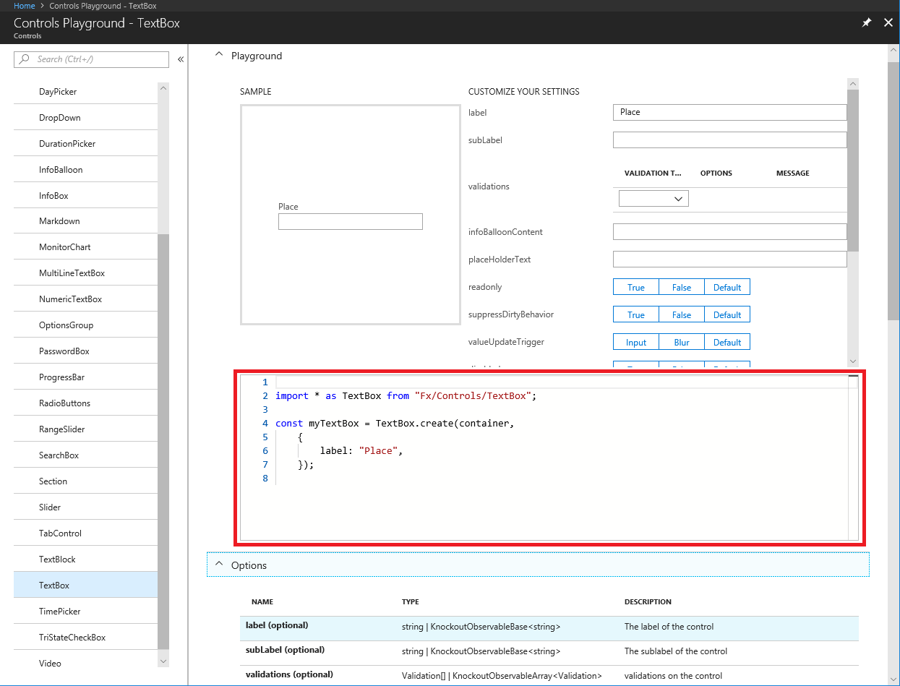
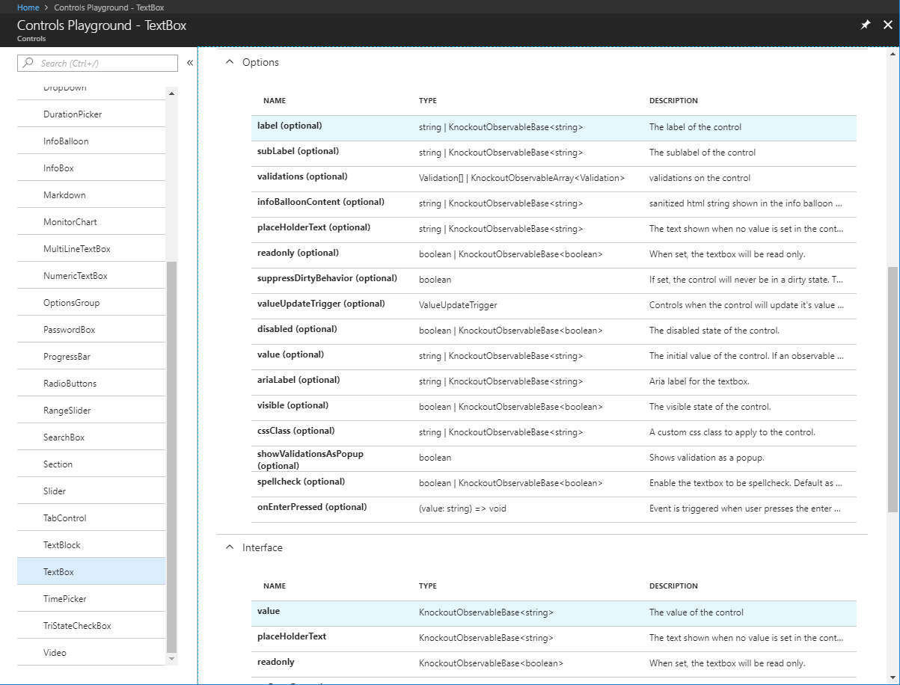

## The controls playground

The controls playground is located at [https://aka.ms/portalfx/playground](https://aka.ms/portalfx/playground), and it provides a space where developers can experiment with controls previous to adding them to an extension. They can see what a control looks like, and how it behaves.

You can quickly provide options for primitive types and enumerations.  The playground lets you configure working instances for basic scenarios.

The following code was generated by the playground to implement the preceding sample.

**NOTE**: You may still need to edit this code in your extension for localization purposes.

The playground provides a quick reference for both the options and the contract of the control, as in the following image.

You quickly see every property that can be sent to the control as an option, in addition to all of the properties that it can return.

For specific playground extension issues or general playground extension feedback, please reach out to  <a href="mailto:ibizacontrols@microsoft.com?subject=Playground Extension issues or feedback">ibizacontrols@microsoft.com</a>.
