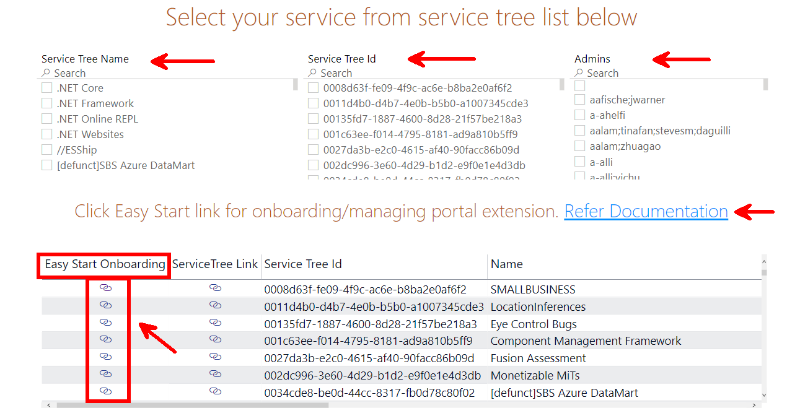
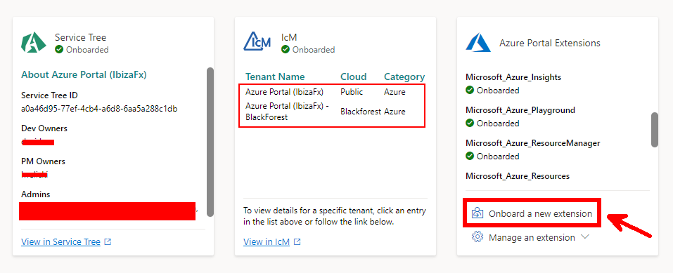
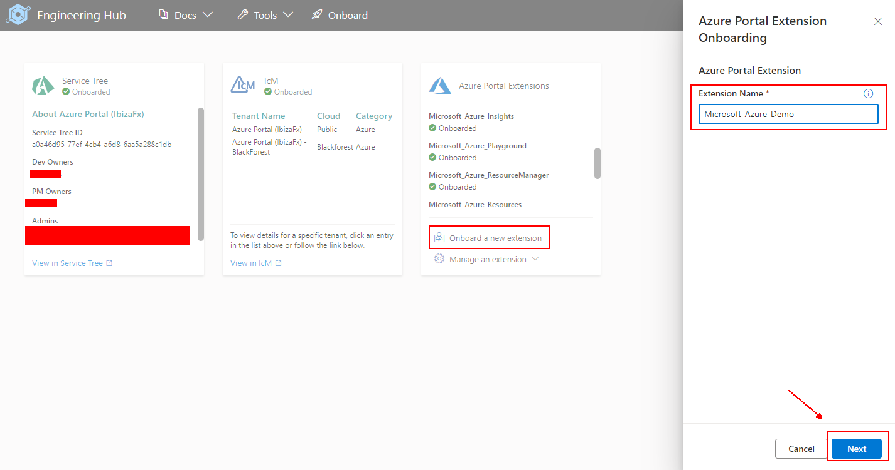
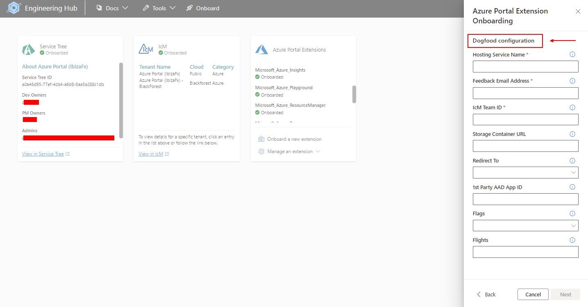
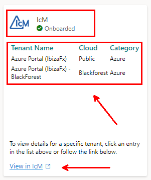
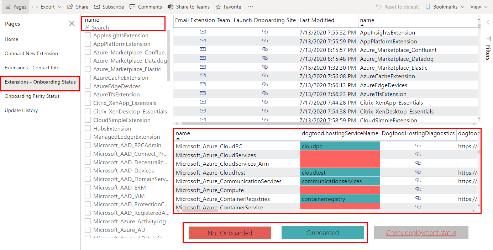
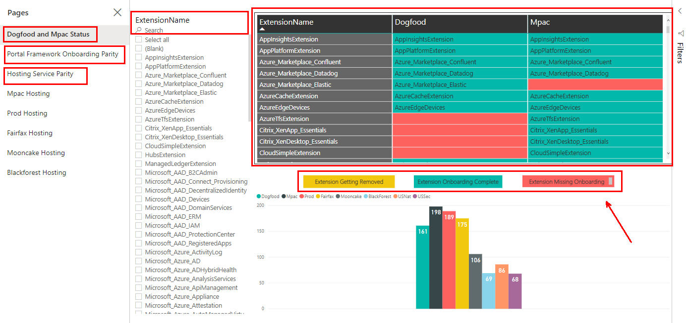

<a name="azure-portal-onboarding-using-easy-start"></a>
# Azure portal onboarding using Easy Start

<a name="azure-portal-onboarding-using-easy-start-introduction"></a>
## Introduction

Azure portal onboarding process is updated and teams looking to onboard new extensions or updating/removing existing extensions do NOT need to raise pull requests going forward. Azure portal has migrated the extension configuration for all clouds to service tree. Partner teams can now manage the configuration through Easy Start onboarding site.

<a name="azure-portal-onboarding-using-easy-start-overview"></a>
## Overview

* Azure portal onboarding is now available through [EasyStart Onboarding](https://aka.ms/portalfx/easystart).

* Azure portal onboarding is self-served using the service tree​ metadata

* Partners won't be required to update any configuration files in Azure portal repositories.​

* No need to raise pull requests or cherry-picking changes across different branches for onboarding or updating configuration

* Partners can onboard to the Azure portal using Easy Start experience that will udpate the corresponding service tree database.

* Portal team will pull the configuration from service tree and deploy the configuration to all clouds​ and across all portal and hosting service branches

* Any manual updates to the Azure portal configuration using pull requests will be discarded or overridden by our automation pipeline.

* Always update the extension configuration using the recommended tools that update the service tree database in the proper format required by Azure portal onboarding automation process.

* Any updates to service tree database directly using tools other than recommended could corrupt the configuration and will impact your service availability.

<a name="azure-portal-onboarding-using-easy-start-step-by-step-process-overview"></a>
## Step by Step Process overview

Onboarding a service, or developing a Portal extension, has three phases: onboarding, development, and deployment. The process is specified in the following image.


<a name="azure-portal-onboarding-using-easy-start-kickoff-meeting"></a>
## Kickoff Meeting

<a name="azure-portal-onboarding-using-easy-start-kickoff-meeting-who-needs-these-meetings"></a>
### who needs these meetings?

* If you have scenarios that do NOT use ARM RP(Resource Provider)or do NOT belong to Azure or need a customized experiences in Portal, you are recommended to setup a meeting a with the Azure portal onboarding team.

* If you are planning to host an Internal only service, you must schedule a meeting with the onboarding team to get the required approvals and then start onboarding.

* If you have scenarios that do NOT require a full fledged extension and plan to surface your existing web interface through Azure portal, you can send a meeting invite to Azure portal onboarding team.

There are lots of docs here. We recommend you send mail to [ibiza-onboarding@microsoft.com](<mailto:ibiza-onboarding@microsoft.com?subject=Kickoff Meeting Request&body=My team would like to meet with you to learn about the Azure onboarding process.>) and request a kickoff meeting. Someone from our team will spend 30 minutes walking through the process at a high level. We can point you in the right direction regarding the latest patterns and practices. We can also answer any questions you have. Finally, we can talk about how the relationship between our teams is managed.

<a name="azure-portal-onboarding-using-easy-start-onboard-with-related-teams"></a>
## Onboard with related teams

Onboarding to Azure all up is a big task that spans many teams. The doc you are reading will help you onboard to the portal, but there are many other teams you will need to work with to get your entire service up and running. These include, but are not limited to the following teams.

**NOTE:**  Contact information for these teams is [available here](https://aka.ms/portalfx/onboarding/partners) 

1. Azure Resource Manager Team
    
    Reach out to this team to onboard your resource provider.
    <!--TODO: Locate distribution list for this purpose.  -->

1. Azure Marketing Team


1. Support Team 

   For integrating with the support system and UX integration.

1. Azure.com team 
   
   For a presence on the marketing site.

1. Billing team 
   
   To register meters and other billing related activities.
   
1. AAD onboarding

   Reach out to AAD onboarding if the new extension service needs special permissions besides just calling your own resource provider servers.  If the extension requires additional built-in support for standard Graph or ARM APIs, submit a partner request at the site located at [https://aka.ms/portalfx/uservoice](https://aka.ms/portalfx/uservoice). 

1. Azure fundamentals and compliance  

    The Azure Fundamentals are a set of tenets to which each Azure service is expected to adhere. The Azure Fundamentals program is described in the document located at [https://aka.ms/azurefundamentals](https://aka.ms/azurefundamentals). The document also identifies the stakeholders and contacts for each of the tenets.

1. Security and privacy reviews  

1. Start the CSS onboarding process with the CSS team at least three months previous to public preview. This process may coincide with the following step. For more information about development phases, see [top-extensions-developmentPhases.md](top-extensions-developmentPhases.md).

1. Nearly 70% of Azure users are from outside of the United States. Therefore, it is important to make Azure a globalized product. There are a few requirements under the "Internationalization" criteria that your extension is required to support.  This is the same set of languages that are supported by Azure Portal for GA. For more information about internationalization requirements, see [http://aka.ms/AzureGR](http://aka.ms/AzureGR). For onboarding localization, please reach out to Bruno Lewin and the Internationalization team at <a href="mailto:ibiza-interntnl@microsoft.com?subject=Onboarding localization">Internationalization team</a>.

1. Decide on a name and URLs for the extension.  You may need to contact emailing <a href="mailto:ibiza-onboarding@microsoft.com?subject=Name and URLs for new Extension">ibiza-onboarding@microsoft.com</a> to ensure that the name and URL's are unique.

1. Schedule a UX feasibility review with the Ibiza team UX contact by emailing <a href="mailto:ibiza-onboarding@microsoft.com?subject=Extension Feasibility Review">ibiza-onboarding@microsoft.com</a>.  Many extensions have been made more successful by setting up early design reviews with the Azure Portal team. Taking the time to review the design gives extension owners an opportunity to understand how they can leverage Azure Portal design patterns, and ensure that the desired outcome is feasible. 

While the portal team cannot help directly with all of these factors, see [portalfx-extensions-contacts.md](portalfx-extensions-contacts.md) for a list of items with which we can assist you.

For less common scenarios, you might need to do a custom deployment. For example, if the extension needs to reach server services using certificate based authentication, then there should be controller code on the server that our hosting service does not support. You should be very sure that  a custom hosting solution is the correct solution previous to developing one.

<a name="azure-portal-onboarding-using-easy-start-join-dls-and-request-permissions"></a>
## Join DLs and request permissions

Request the following permissions to stay current on product roadmaps, get news on latest features, and receive invites for ibiza related events.

* PMs and Developer Leads should join the `ibizapartners PM`  group [here](https://idweb/IdentityManagement/aspx/common/GlobalSearchResult.aspx?searchtype=e0c132db-08d8-4258-8bce-561687a8a51e&content=ibizapartners-pm&popupFromClipboard=%2Fidentitymanagement%2Faspx%2FGroups%2FEditGroup.aspx%3Fid%3Dacc725b5-30aa-4336-9c81-1867762bb945).

* Developers should join the `ibizapartners DEV` group [here](https://idweb/IdentityManagement/aspx/common/GlobalSearchResult.aspx?searchtype=e0c132db-08d8-4258-8bce-561687a8a51e&content=ibizapartners-pm&popupFromClipboard=%2Fidentitymanagement%2Faspx%2FGroups%2FEditGroup.aspx%3Fid%3D109b1485-33c5-4c00-8e85-69d9b6176b9f).

* Developers should join the appropriate group listed on [http://aka.ms/standardaccess](http://aka.ms/standardaccess) to get access to portal telemetry. All groups on this page receive access.

* Developers should join the  `Azure Portal Partner Contributors - 19668(19668)` group by using this link: [https://myaccess](https://myaccess).

* PMs, Developers, and Developer Leads should subscribe to the partner request process by joining the ```Uservoice ``` group at this link:  [https://aka.ms/portalfx/uservoice](https://aka.ms/portalfx/uservoice). For more information about the partner request process, see [top-extensions-partner-request.md](/portal-sdk/generated/top-extensions-partner-request.md).

* PMs, Developers, and Developer Leads  should join Stackoverflow Forums that are located at [https://stackoverflow.microsoft.com](https://stackoverflow.microsoft.com)  to let us know if you have any questions. Remember to tag questions with supported tags that are monitored by the Ibiza team. All supported tags are documented in [portalfx-stackoverflow.md](portalfx-stackoverflow.md).

* Developers who want to contribute to the test framework should join groups from the site located at [http://aka.ms/azuregithub](http://aka.ms/azuregithub).

Ask an onboarding question on [Stackoverflow](https://stackoverflow.microsoft.com/questions/tagged/ibiza-onboarding).

<a name="azure-portal-onboarding-using-easy-start-onboarding-requirements"></a>
## Onboarding Requirements

* All **services must be registered in Service Tree** and contain a **valid service tree id with an IcM team registered for each cloud** that the portal extension is onboarding to.

* Services must **decide on the name of the extension** before onboarding. **Obtain necessary leadership approval** for the name that you intend to use to **avoid changing the name** in future.

* Service must **check with Marketing or CELA** if required about the service name

* Services must have a **dedicated IcM service and team** for the Portal extension per cloud.

* Services must **onboard to Azure Support** and have required PESID. Please reach out to Azure supportability champs.

* Services must have **clearly defined Support Topics** created for their Product along with **corresponding root cause topics**.

* **Service owners are responsible** for their Preview and GA level KPIs as defined by Azure Global or Azure portal or Azure compliance teams.

* A **service tree id can be associated with one or more Azure portal extensions**. Eg: Azure Portal, IaaS Experiences, AAD, Intune

* **Third Party services must have a VP/Partner level sponsor** at Microsoft and must always be onboarded with the help of Azure portal team's guidance

* Partners must **[hide assets](portalfx-assets.md#how-to-hide-or-show-your-asset-in-different-environments)** in the environments that they do not want to show the portal extension specific assets.

* Portal **[deployment SLAs](top-extensions-svc-lvl-agreements.md)** may **change based on the leadership guidance or other company events like //build, //ignite or other conferences**

* Partners must **update their SDK version every 60-120-days** failing which the extension may not work as expected and cause live site incidents.

* Partners must **acknowledge and resolve IcM alerts** fired for extensions to avoid escalations.

* **SDK age alerts** or other extension related service health alerts **must be resolved** with high priority

* **Orphaned services or extensions** must be removed from Portal using the **deprecation** option.

* Partners must **create storage accounts for each of the environments** in the respective clouds and subscriptions. **Dogfood and Public environments can use storage accounts from Public subscriptions**

* **Partners are responsible for any delays in onboarding** to any cloud as **portal automation deploys the changes from service tree** as provided for a given extension.

* **Insufficient data** in the extension configuration **could affect the extension availability and performance**.

* **Service tree entries must not be removed** or cleared without informing the Azure portal team **if you own an active extension** in Azure portal.

<a name="azure-portal-onboarding-using-easy-start-required-and-optional-fields"></a>
## Required and Optional fields

Please review the following required and optional fields for Portal extension.

| Field Name | Description | Required | Sample |
| ----------- | ------------------------------------------------- | -------- | -------- |
| Extension Name | Name of the extension | True | Microsoft_Azure_DemoExtension |
| Hosting Service Name | Name of the extension | True | demoextension |
| Feedback Email | Email enabled security group consisting of PMs and Developers of the extension | True | demoextPMDev@microsoft.com |
| Icm Team Id | Team Id of the IcM for the given cloud | True | 12345 (numeric values only) |
| Storage Container URL | URL of the storage container in the given cloud with Anonymous read access | True | https://demostorage.core.windows.net/containername |
| Redirect To | Required only if you intend to redirect the new extension to an existing one owned by your team | False | Microsoft_Azure_OldDemoExtension |
| 1st Party AAD App ID | This should be a 1st party AAD App owned by your team | False | demoextension |
| Flags | Pre-defined flags as listed | False | SupportsPrewarming, Disabled, ThirdPartyExtension |
| Flights | Name of the flight | False | MpacFlight |

<a name="azure-portal-onboarding-using-easy-start-unsupported-scenarios-and-fields"></a>
## Unsupported scenarios and fields

* **Adding/Updating resourceAccess is not supported** with the new onboarding model.

* Please use the **[new resourceAceess client side configuration model](top-extensions-authentication-procedures.md#migrating-resource-access-configuration)** for all extensions

* Please **migrate your existing extensions** to the **[new resourceAceess client side configuration model](top-extensions-authentication-procedures.md#migrating-resource-access-configuration)**

* Partners who **require resourceAccess to call other backend services like graph, keyvault** or other custom services, must **use client side configuration** to add resourceAccess.

* If you have scenarios that **need help updating resourceAccess or migrating to new model**, please schedule some time with the Azure portal [Onboarding Team](mailTo:ibiza-onboarding@microsoft.com).

Please post your onboarding questions on Stackoverflow using the tag [ibiza-onboarding](https://stackoverflow.microsoft.com/questions/tagged/ibiza-onboarding) or email [Onboarding Team](mailTo:ibiza-onboarding@microsoft.com)


<a name="azure-portal-onboarding-using-easy-start-step-by-step-guide-to-portal-onboarding"></a>
## Step By Step guide to Portal onboarding

* Visit the **[Onboarding Dashboard](https://aka.ms/portalfx/onboarding/dashboard)**.

* If you **do not have access** to this dashboard, **please join**   **[ibizapartners-pm](http://igroup/join/ibizapartners-pm)** or **[ibizapartners-dev](http://igroup/join/ibizapartners-dev)** as appropriate.

* **Search your service** from the list either by **service tree name** or **service tree id** or **service tree admin**.

* Click on the link against your service under the "Easy Start Onboarding"



* For onboarding a new extension, please click **"Onboard a new extension"** under **Azure portal Extensions** card

    1) Validate the Service Tree Id
    2) Validate the IcM Team Name, Cloud are valid for the type of onboarding.
    3) Make sure the user is part of the admins group as listed in



<a name="azure-portal-onboarding-using-easy-start-onboading-wizard"></a>
## Onboading Wizard

<a name="azure-portal-onboarding-using-easy-start-onboading-wizard-extension-name"></a>
### <strong>Extension Name</strong>

* Enter a unique Extension Name as per **naming convention "Microsoft_Azure_ExtensionName"**.
* Please **check with Marketing team or your leadership team** before deciding a name and onboard to Azure portal.​
* Extension Name **cannot be renamed**.
* Extension Name **must be common across all clouds**
* Extension Name is shown in the URL and get stamped in user settings when accessing specific resource types.

**Screenshot - 1**


**Screenshot - 2**


<a name="azure-portal-onboarding-using-easy-start-onboading-wizard-hosting-service-name"></a>
### <strong>Hosting Service Name</strong>

* **Must be unique** across all extensions.

* Used in the extension's csproj file as **HostingServiceRoutePrefix**. [More Info](top-extensions-hosting-service.md#build-configuration).

<a name="azure-portal-onboarding-using-easy-start-onboading-wizard-feedback-email-address"></a>
### <strong>Feedback Email Address</strong>

* Please enter a valid **email enabled security group** with the list of PMs and Developers responsible for handling any issues with this extension.

* User adding/udpating the extension configuration must be part of the feedback email group.

<a name="azure-portal-onboarding-using-easy-start-onboading-wizard-icm-team-id"></a>
### <strong>IcM Team Id</strong>

* Please enter a valid **IcM Team Id(numeric values only)** of the registered IcM service and team for this extension.

* IcM Team Id must be cloud specific and must have assignable property set to true.

* You may use the same Id for Dogfood and Production extensions.

* Sovereign clouds must have their own valid IcM Team Id

* IcM service and team must be registered in the same service tree id as the extension or its service group.

* You can **lookup Team Id** in active IcM services report available at **https://aka.ms/portalfx/partners/icm** under the "All Active IcM Teams"

**Note:** IcM Team Ids are shown in Easy Start. Please click on the entries under Tenant Name on the IcM Tile.



<a name="azure-portal-onboarding-using-easy-start-onboading-wizard-storage-container-url"></a>
### <strong>Storage Container URL</strong>

* Please enter a valid **storage container URL**.

* **Dogfood and Production extensions** can create storage accounts in public cloud subscription.

* **Sovereign clouds must always use respective cloud storage account** from the corresponding cloud subscription. **Eg: Fairfax storage account must be created in Fairfax subscription**.

* Create **separate storage account for each environment**
eg: Dogfood, Prod, Mooncake, Fairfax and BlackForest

* **Create a container** under the storage account with **anonymous read access**.

* Upload the [config.json](top-extensions-hosting-service.md#step-6-upload-safe-deployment-config) and the [generated zip file](top-extensions-hosting-service.md#step-1-generate-hosting-service-versioned-zip-file) from your build.


<a name="azure-portal-onboarding-using-easy-start-onboading-wizard-redirect-to"></a>
### <strong>Redirect To</strong>

* This is **applicable only if you already have an extension registered in your service that you would like to redirect to**.

* Since **Azure portal does not allow renaming of extensions**, our **recommendation is to create a new extension and redirect to old one** using this option.

* Extensions are **NOT required to create a storage account to redirect extension** or specify one if you intend to redirect to an existing extension. Extensions **must specify the hosting service name that is used by the previous extension**.

<a name="azure-portal-onboarding-using-easy-start-onboading-wizard-st-party-aad-app-id"></a>
### <strong>1st party AAD App Id</strong>

* All **extensions must [register a 1st party AAD app](top-onboarding-new.md#aad-onboarding) if you are calling graph or other backend services**.

* Extensions **do NOT need 1st party AAD app if you only call ARM**

* Do NOT use multiple 1st party AAD apps in one extension.

* Extensions may use one AAD apps across multiple extensions.

<a name="azure-portal-onboarding-using-easy-start-onboading-wizard-flags"></a>
### <strong>Flags</strong>

* All new extension onboarding must use **"SupportsPrewarming"**.

* Do NOT use **"Disabled"** unless you have are a custom domain partner and require hiding your extension.

* **"ThirdPartyExtension"** must be used if the service is non-Microsoft. **Not using the ThirdPartyExtension for non-Microsoft services is considered as security and privacy violation** and could potentially leak user data.

* Any **services calling services outside of Microsoft and NOT using ThirdPartyExtension flag will be removed** from Azure portal.

<a name="azure-portal-onboarding-using-easy-start-onboading-wizard-flights"></a>
### <strong>Flights</strong>

* Flights are named versions that can be loaded in **[MPAC](https://ms.portal.azure.com)**. [See more](top-extensions-flighting.md#mpac-flighting)

* You can add a flighted version to the config.json in your extension package and specify that name in this field.

<a name="azure-portal-onboarding-using-easy-start-frequently-asked-questions"></a>
## Frequently Asked Questions

* ***I am unable to update my existing extension as the next button is disabled. What am I doing wrong?***

    * New onboarding process requires all extensions to be onboarded to be onboarded to Dogfood configuration prior to onboarding to Production or National clouds.

    * **Missing Dogfood configuration** may cause extensions not to show "Next" button

    * **Check the IcM** Team Id which must be a valid IcM team for your service. See above requirements for IcM Team Id.

    * You can **fill in the values for dogfood configuration** as per your existing production configuration in this section and continue to next screen.

    * You are **recommended to use a different storage account** for the dogfood environment.

    * You can **disable your dogfood extension if you do not intend to use** this.

* ***I do NOT plan to onboard to Sovereign clouds immediately. Can I skip them?***

    * All services that are in scope for **National/Sovereign clouds are required to onboard to the respective clouds as per the guidelines provided by Azure Global team**.

    * Please **reach out to Azure Global team** to check for the timelines and requirements on onboarding to National/Sovereign clouds.

* Where can I find IcM Team Id?

    * You check the **[IcM Tenant Details](https://icm.ad.msft.net/imp/ManageTenants.aspx)** for your service.

    * You can also **lookup for Team Id** in the **All Active IcM Services** tab in the **[IcM Services PowerBi Dashboard](https://aka.ms/portalfx/partners/icm)**

<a name="azure-portal-onboarding-using-easy-start-how-to-verify-onboarding-status"></a>
## How to verify onboarding status

* Visit **https://aka.ms/portalfx/onboarding/status**

* **Search or select** your extension and check the details.

* All **extensions onboarded through service** tree will be listed in this report. Any **manual updates to the Portal configuration will NOT be included** in this report and will be overridden by new onboarding automation.

* Report will be **refreshed every few hours**.


<a name="azure-portal-onboarding-using-easy-start-how-to-verify-deployment-status"></a>
## How to verify deployment status

* Visit **https://aka.ms/portalfx/deploymentstatus**

* **Search or select** your extension and check the details.

* Report will be **refreshed every few hours**.


<a name="azure-portal-onboarding-using-easy-start-ownership-transfer-requirements"></a>
## Ownership-transfer Requirements

* Transferring ownership of a service or extension in Azure portal requires creating a task to Azure portal and working with Azure portal onboarding team to complete the task.

* Partners must update SDK to the latest supported version before ownership transfer

* Partners must update the IcM service and team if ownership is transferred along with the feedback email address of the new owners

<a name="azure-portal-onboarding-using-easy-start-off-boarding-deprecation-of-service"></a>
## Off-boarding / Deprecation of service

* Deprecation or retiring experience of any service that is in GA requires 90 days notice to customers and services in Public Preview require 30days notice to customers.

* Service owners can set the Flags to "Disabled" to turn of the extension rendering in Azure portal. Any bookmarks or deep-links will continue to work until the extension is fully deprecated.

<a name="azure-portal-onboarding-using-easy-start-aad-onboarding"></a>
## AAD Onboarding

NOTE: ARM tokens obtained during portal login are meant only for calling ARM. For all other purposes, please create a 1st party App.

* Register your 1st party AAD app from **[First Party Portal](https://firstpartyportal.msidentity.com/RegisterApp)**

* Go to Provisioning tab and select **unknown** in the dropdown for **How will you make your application available to customers** and in the **"Provide more detail"** section, add **"This app will be used by Azure portal extension to call graph and other backend services"**.

* Go to the **Owners** tab and use an email enabled security group that you and your team are part of **domain\securitygroup** as the **Owners Security Group**

* Use the **Subject Name Issuer in the authentication tab** as recommended in **[this document](https://aka.ms/portalfx/SNI)**.

* Add any other required fields as appropriate and submit your application.

* After the PPE app is approved, you can edit and go to the app's environment section and promote to the Prod branch. Similarly you can promote to other environments if the Prod app is approved.

**IMPORTANT NOTE: *Partners are responsible for making sure the AAD app has all the required permissions and pre-authorization to access intended resources.***
<!--
TODO - Add an example after the feature is ready (ETA is March or April )
-->


<a name="azure-portal-onboarding-using-easy-start-useful-links"></a>
## Useful links

| Link | Description |
| ----------- | ------- |
| [Getting Started](https://aka.ms/portalfx/onboarding/gettingstarted) | How To: Getting started with Azure portal SDK |
| [Architecture](https://aka.ms/portalfx/onboarding/architecture)     | Azure portal architecture  |
| [Onboarding PPT](https://aka.ms/portalfx/onboarding/ppt)     | Azure portal Onboarding Powerpoint Slides  |
| [Samples Playground](https://aka.ms/portalfx/onboarding/ppt)     | Azure portal Samples Playground  |
| [Authentication in Azure portal](https://aka.ms/portalfx/auth)     | How To: Azure portal authentication  |
| [Azure portal Release Pipeline](https://dev.azure.com/msazure/One/_dashboards/dashboard/adf2732d-f4a9-476d-a7a7-7ab7aab4a2ad)     | Check Framework Service release pipeline  |
| [Hosting Service Release Pipeline](https://dev.azure.com/msazure/One/_dashboards/dashboard/25be4cd4-4fbd-45c9-b257-79baf530abbe)     | Check Hosting Service release pipeline   |
| [Check Framework Commits](https://commits.azurewebsites.net/#repos/AzureUX-PortalFx/commits)     | Check commit status for Framework   |
| [Check Hosting Service Commits](https://commits.azurewebsites.net/#repos/AzureUX-PortalHostingSvc/commits)     | Check commit status for Hosting Service   |
| [Simonp-Sites Commits](http://simonp-sites/commits/search)     | Alternative tool for framework commit status   |
| [Simonp-Sites Pipeline](http://simonp-sites/pipeline)     | Alternative tool for pipeline   |
| [Simonp-Sites Environments](http://simonp-sites/environments)     | Alternative tool for environments   |

You can ask developer community questions on Stackoverflow with the tag [ibiza-onboarding](https://stackoverflow.microsoft.com/questions/tagged/ibiza-onboarding) or use the following for specific areas of Ibiza.

<a name="azure-portal-onboarding-using-easy-start-stackoverflow-forums"></a>
## Stackoverflow Forums

The Ibiza team strives to answer the questions that are tagged with Ibiza tags on the Microsoft [Stackoverflow](https://stackoverflow.microsoft.com) Web site within 24 hours. If you do not receive a response within 24 hours, please email the owner associated with the tag.

To help the Azure UI team answer your questions, the submissions are categorized into various topics that are marked with tags.
To read forum submissions, enter the following in the address bar of your browser:

```https://stackoverflow.microsoft.com/questions/tagged/<ibizaTag>```

To ask a question in a forum, enter the following in the address bar of your browser.

```https://stackoverflow.microsoft.com/questions/ask?tags=<ibizaTag>```

where

**ibizaTag**:  One of the tags from the following table, without the angle brackets.

You can also click on the links in the table to open the correct Stackoverflow forum.

| Tag                                                                                                   | Purpose                                                                                       | Owner               | Contact |
| ----------------------------------------------------------------------------------------------------- | --------------------------------------------------------------------------------------------- | ------------------- | ------- |
| [ibiza](https://stackoverflow.microsoft.com/questions/tagged/ibiza)                                   | This is a generic Ibiza tag that should only be used when none of the below tags apply to your question. The 24 hour response SLA does not apply to this tag as someone from the Ibiza team has to triage the question and send it to the appropriate owner. Please use one of the below tags when possible and resort to this tag only when none of the other tags apply.   | Shrisha Kumar     | |
| [ibiza-accessibility](https://stackoverflow.microsoft.com/questions/tagged/ibiza-accessibility)       | Questions regarding accessibility onboarding, best practices, supported accessible controls, etc. Also, questions regarding the accessibility bug process and exception process.         | Paymon Parsadmehr   | <a href="mailto:ibiza-accessibility@microsoft.com?subject=Stackoverflow: Accessibility">ibiza-accessibility@microsoft.com </a> |
|[ibiza-alert](https://stackoverflow.microsoft.com/questions/tagged/ibiza-alert)|A tag for questions related to the alerting and monitoring framework that Ibiza provides for extension owners.|Ayesha Ghaffar| |
| [ibiza-az](https://stackoverflow.microsoft.com/questions/tagged/ibiza-az)                             | Questions related to the '`Az`' FX feature that renders a standard HTML page into a Blade or Part (rendered in a child IFrame). | Brad Olenick | |
| [ibiza-blades-parts](https://stackoverflow.microsoft.com/questions/tagged/ibiza-blades-parts)         | A tag for all questions related to Ibiza Blades, Parts (Tiles), Commands.                     | Sean Watson         | |
| [ibiza-breaking-changes](https://stackoverflow.microsoft.com/questions/tagged/ibiza-breaking-changes) | Breaking changes that are are insufficiently documented on [https://aka.ms/portalfx/breaking](https://aka.ms/portalfx/breaking)  | Shrisha Kumar | |
| [ibiza-browse](https://stackoverflow.microsoft.com/questions/tagged/ibiza-browse)                     | The primary navigation path in the Azure Portal. Browse consists of the Browse/Services menu, the resource list blade, and pinned part. Browse supports ARM subscription resources, ARM tenant resources, as well as custom data or simply launching your own blade. Learn more at [http://aka.ms/portalfx/browse](http://aka.ms/portalfx/browse).                                                     | Adrienne Chan         | |
| [ibiza-controls](https://stackoverflow.microsoft.com/questions/tagged/ibiza-controls)                 | Tag for questions related to Ibiza's control library                                | Paymon Parsadmehr    | |
| [ibiza-controls-grid](https://stackoverflow.microsoft.com/questions/tagged/ibiza-controls-grid)       | A tag specially for questions related to Ibiza's Grid controls.   | Paymon Parsadmehr    | |
| [ibiza-create](https://stackoverflow.microsoft.com/questions/tagged/ibiza-create) | A tag for questions related to Ibiza's resource create experiences and provisioning APIs. | Balbir Singh        | |
| [ibiza-data](https://stackoverflow.microsoft.com/questions/tagged/ibiza-data) | A tag for questions related to the Batch API that Ibiza supports. | Balbir Singh | |
| [ibiza-development](https://stackoverflow.microsoft.com/questions/tagged/ibiza-development)   | A tag for questions related local development of extensions like IDE integration, side-loading etc. | Shrisha Kumar | |
| [ibiza-missing-docs](https://stackoverflow.microsoft.com/questions/tagged/ibiza-docs)         | Topics that are not included in [https://aka.ms/portalfx/docs](https://aka.ms/portalfx/docs), are incomplete, or are difficult to understand  | Shrisha Kumar | |
| [ibiza-forms](https://stackoverflow.microsoft.com/questions/tagged/ibiza-forms)                       | An Ibiza monitored tag for questions related to Azure Portal forms                            | Paymon Parsadmehr    | |
| [ibiza-hosting-service](https://stackoverflow.microsoft.com/questions/tagged/ibiza-hosting-service)   | Questions related to the Hosting Service. For questions related to on-boarding to the Hosting Service, please use the ibiza-onboarding tag. | Shrisha Kumar | |
| [ibiza-hubs](https://stackoverflow.microsoft.com/questions/tagged/ibiza-hubs)   | Questions related to the Hubs extension. | Balbir Singh | |
| [ibiza-localization-global](https://stackoverflow.microsoft.com/questions/tagged/ibiza-localization-global) | Questions related to Localization or globalization within the portal. Guidence on what is or is not supported, and current languages that the Portal supports.                                                             | Shrisha Kumar   | |
| [ibiza-notifications](https://stackoverflow.microsoft.com/questions/tagged/ibiza-notifications) | Tag for questions related to notifications in the Azure Portal. | Paymon Parsadmehr | |
| [ibiza-onboarding](https://stackoverflow.microsoft.com/questions/tagged/ibiza-onboarding) | A tag for questions related to on-boarding a new extension to the Azure Portal or onboarding to the Hosting Service | Santhosh Somayajula | |
| [ibiza-performance](https://stackoverflow.microsoft.com/questions/tagged/ibiza-performance)           | Questions related to Ibiza performance.                                                       | Sean Watson         | <a href="mailto:ibiza-perf@microsoft.com?subject=Stackoverflow: Performance">ibiza-perf@microsoft.com </a> |
| [ibiza-react](https://stackoverflow.microsoft.com/questions/tagged/ibiza-react)           | Questions related to Ibiza React views development.                                                       | Sean Watson         | |
| [ibiza-sdkupdate](https://stackoverflow.microsoft.com/questions/tagged/ibiza-sdkupdate)               | Issues encountered during updating from one version of the ibiza sdk to another, for example,  **NuGet**, **Node Modules**, **PowerShell**, or **AzureUX-TemplateExtension** project template-related issues   | Shrisha Kumar | |
| [ibiza-security-auth](https://stackoverflow.microsoft.com/questions/tagged/ibiza-security-auth)       | Questions related to Portal Authentication, Security model, AAD onboarding, Ibiza extension onboarding. Please provide details on your extension name and requirements/scenarios.                                         | Santhosh Somayajula | |
| [ibiza-telemetry](https://stackoverflow.microsoft.com/questions/tagged/ibiza-telemetry)               | All questions regarding Ibiza-Telemetry                                                       | Ayesha Ghaffar | ibiza-telemetry@microsoft.com</a> |
| [ibiza-test](https://stackoverflow.microsoft.com/questions/tagged/ibiza-test)                         | The CSharp test framework `Microsoft.Portal.TestFramework` and the nodejs test framework `msportalfx-test` and `msportalfx-ut` | Shrisha Kumar | |
